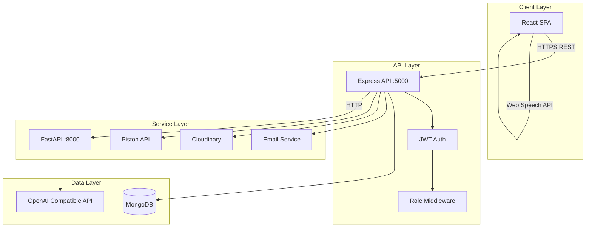

# System Architecture

## Overview

The platform follows a microservices-inspired architecture with three independently deployable services:

1. **Frontend** (React/Vite) — User interface
2. **Backend API** (Express/Node.js) — Business logic, auth, data persistence
3. **AI Service** (FastAPI/Python) — LLM-powered analysis, question generation, evaluation

## Architecture Diagram

## Communication Patterns

### Resume Analysis Flow
1. Candidate uploads resume → Backend validates & stores in Cloudinary
2. Backend calls AI Service `/resume/analyze` with file URL + job description
3. AI Service extracts text (PyMuPDF/python-docx), calls LLM for analysis
4. Backend stores result in Reports collection
5. Recruiter views report in dashboard

### Assessment Flow
1. Candidate starts test → Backend creates Interview session
2. Questions loaded from bank or AI-generated via AI Service
3. Answers submitted → Backend evaluates (MCQ comparison or Piston code execution)
4. Scores stored in Interview document

### AI Interview Flow
1. Backend creates interview session, gets first question from AI Service
2. Candidate responds via text/voice (Web Speech API in browser)
3. Each message sent to backend → forwarded to AI Service for next question
4. On completion, AI Service evaluates full conversation
5. Results stored in Results collection

## Security Architecture

- JWT access tokens (15 min) + refresh tokens (7 days, httpOnly cookie)
- bcrypt password hashing (12 rounds)
- Helmet security headers
- CORS restricted to frontend origin
- Rate limiting on auth and AI endpoints
- Input validation with Zod (backend) and React Hook Form + Zod (frontend)
- File upload MIME whitelist and size limits

## Deployment Topology

| Service | Platform | Port |
|---------|----------|------|
| Frontend | Vercel | 443 |
| Backend | Render | 5000 |
| AI Service | Render | 8000 |
| Database | MongoDB Atlas | 27017 |
