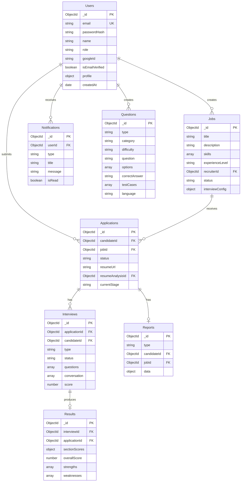

# Database Schema

## ER Diagram



## Collections

### Users
- **Indexes**: `email` (unique), `googleId` (sparse)
- **Roles**: `admin`, `recruiter`, `candidate`
- **Profile** (candidates): skills, experience, education, certifications, portfolio links, resume URL

### Jobs
- **Indexes**: `recruiterId`, `status`
- **Status**: `draft`, `active`, `closed`
- **Interview Config**: aptitude, technical, AI interview toggles

### Applications
- **Indexes**: `candidateId + jobId` (unique), `jobId + status`
- **Status flow**: applied → screening → assessment → interview → shortlisted/rejected

### Questions
- **Types**: aptitude, mcq, coding, sql, debugging
- **Categories**: aptitude, logical_reasoning, quantitative, verbal_ability

### Interviews
- **Types**: aptitude, technical, ai_hr
- **Anti-cheat flags**: tabSwitches, pasteEvents, fullscreenExits

### Results
- **Section scores**: technical, communication, problemSolving, aptitude, confidence, grammar, fluency, relevance

### Reports
- **Types**: resume_analysis, interview_evaluation

## Sample Document — Resume Report

```json
{
  "type": "resume_analysis",
  "candidateId": "ObjectId",
  "jobId": "ObjectId",
  "data": {
    "skills": ["React", "Node.js", "TypeScript"],
    "atsScore": 82,
    "jobMatchScore": 78,
    "matchedSkills": ["React", "Node.js"],
    "missingSkills": ["AWS"],
    "improvements": ["Add AWS certification"],
    "recruiterSummary": "Strong full-stack developer."
  }
}
```
